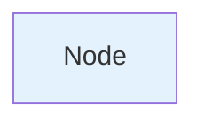

# Letta Documentation Diagrams

This directory contains mermaid diagram code for the Letta documentation.

## Diagrams Included

### 1. Agent Reasoning Loop (`agent-reasoning-loop.md`)
**Purpose:** Shows how an agent processes a user message step-by-step
**Location:** `fern/pages/agents/overview.mdx`
**Key insight:** Illustrates the complete lifecycle from request to response, including tool calls

### 2. Memory Hierarchy (`memory-hierarchy.md`)
**Purpose:** Explains the difference between in-context and out-of-context memory
**Location:** `fern/pages/agents/memory.mdx`
**Key insight:** Clarifies why memory blocks are different from RAG/vector search

### 3. Stateful vs Stateless (`stateful-vs-stateless.md`)
**Purpose:** Shows why Letta's stateful design is fundamentally different
**Location:** `fern/pages/concepts/letta.mdx` or homepage
**Key insight:** The "aha moment" - explains why you only send new messages

### 4. Tool Execution Lifecycle (`tool-execution-lifecycle.md`)
**Purpose:** Demystifies how tools are registered, called, and executed
**Location:** `fern/pages/agents/tools.mdx`
**Key insight:** Shows the sandbox execution and tool schema generation

### 5. System Architecture (`system-architecture.md`)
**Purpose:** Complete picture of all Letta components
**Location:** `fern/pages/getting-started/letta_platform.mdx`
**Key insight:** Shows how everything fits together

## How to Use These Diagrams

### 1. Copy the mermaid code blocks into your .mdx files

```markdown
---
title: Your Page Title
---

Your intro text...

```mermaid
[paste diagram code here]
```

Your explanation text...
```

### 2. Customize as needed

Each diagram includes:
- Main version (detailed)
- Alternative version (simplified)
- Explanation text
- Usage notes

Use whichever fits your page best.

### 3. Styling

Mermaid supports both light and dark themes automatically. The diagrams use colors that work in both modes.

To customize colors:


## Recommended Diagram Placements

### Critical (Add immediately)
1. **Stateful vs Stateless** → Homepage or concepts page (highest impact)
2. **Agent Reasoning Loop** → Agents overview page
3. **Memory Hierarchy** → Memory guide page

### High Priority
4. **Tool Execution** → Tools guide page
5. **System Architecture** → Platform overview page

### Future Additions
6. Multi-agent communication diagram
7. Sleep-time agent architecture
8. Context window management
9. Streaming architecture
10. Authentication flow

## Creating New Diagrams

When creating new diagrams for Letta docs:

### Use consistent colors:
- Blue (`#e3f2fd`) - Client/API layer
- Purple (`#f3e5f5`) - Server/runtime
- Yellow (`#fff9c4`) - Storage/memory
- Green (`#e8f5e9`) - External services

### Keep them simple:
- One concept per diagram
- 5-10 nodes maximum
- Clear labels and annotations

### Provide alternatives:
- Detailed version for in-depth pages
- Simplified version for quickstarts
- Code comparison when relevant

### Include explanations:
- What the diagram shows
- Why it matters
- How it relates to code

## Mermaid Resources

- [Mermaid Live Editor](https://mermaid.live/) - Test your diagrams
- [Mermaid Documentation](https://mermaid.js.org/) - Syntax reference
- [Fern Mermaid Support](https://buildwithfern.com/learn/docs/content/diagrams) - How Fern renders mermaid

## Testing

Before committing diagrams:
1. Test in [Mermaid Live Editor](https://mermaid.live/)
2. Check both light and dark themes
3. Verify on mobile (diagrams should be responsive)
4. Ensure text is readable at all sizes

## Contributing

To add a new diagram:
1. Create a new `.md` file in this directory
2. Include mermaid code, alternatives, and explanation
3. Add entry to this README
4. Open PR with screenshot of rendered diagram

## Questions?

Slack: #docs
Owner: Documentation Team
