# Agent Reasoning Loop

**Location:** Add to `fern/pages/agents/overview.mdx` after the "Building Stateful Agents" introduction

**What it shows:** The complete lifecycle of an agent processing a user message, including internal reasoning, tool calls, and responses.

## Diagram Code

## Alternative: Simplified Version

If the above is too detailed, use this simpler version:

```mermaid
sequenceDiagram
    participant User
    participant Agent
    participant LLM
    participant Tools

    User->>Agent: "What's the weather?"

    loop Agent Reasoning Loop
        Agent->>LLM: Send context + message
        LLM-->>Agent: Think + decide action

        alt Agent calls tool
            Agent->>Tools: Execute tool
            Tools-->>Agent: Return result
            Note over Agent: Continue loop with result
        else Agent responds to user
            Agent-->>User: "It's sunny, 72°F"
            Note over Agent: Loop ends
        end
    end
```

## Explanation to Add

After the diagram, add this text:

> **How it works:**
>
> 1. **User sends message** - A single new message arrives via the API
> 2. **Agent loads context** - System retrieves agent state, memory blocks, and conversation history from the database
> 3. **LLM reasoning** - The agent thinks through the problem (chain-of-thought)
> 4. **Tool execution** - If needed, the agent calls tools to gather information or take actions
> 5. **Response generation** - The agent formulates its final response to the user
> 6. **State persistence** - All steps are saved to the database for future context
>
> Unlike stateless APIs, this entire loop happens **server-side**, and the agent's state persists between messages.

## Usage Notes

- Use the **detailed version** for the main agents overview page
- Use the **simplified version** for the quickstart guide
- Link between the two versions
