# Memory Hierarchy Architecture

**Location:** Add to `fern/pages/agents/memory.mdx` replacing or expanding the current content

**What it shows:** How Letta's memory system works with in-context and out-of-context storage tiers.

## Diagram Code

```mermaid
graph TB
    subgraph Context["🧠 LLM Context Window (In-Context Memory)"]
        direction TB
        SP[System Prompt]
        MB[Memory Blocks]
        RM[Recent Messages]

        subgraph MemBlocks["Core Memory (Self-Editing)"]
            P[👤 Persona Block<br/>Who the agent is]
            H[👥 Human Block<br/>Who you are]
            C1[📝 Custom Block 1<br/>Project context]
            C2[📊 Custom Block 2<br/>Task state]
        end

        SP --> MB
        MB --> MemBlocks
        MB --> RM
    end

    subgraph External["💾 External Storage (Out-of-Context Memory)"]
        direction TB

        subgraph Recall["Recall Memory (Archival)"]
            OLD[Older Messages<br/>Searchable by semantic similarity]
        end

        subgraph Data["Data Sources"]
            FILES[Files & Documents<br/>PDFs, text, etc.]
            ARCH[Archival Memory<br/>Facts & knowledge]
        end
    end

    MemBlocks -->|Agent edits| MemBlocks
    MemBlocks -.->|Agent searches when needed| Recall
    MemBlocks -.->|Agent searches when needed| Data

    RM -->|When context fills| Recall

    style Context fill:#e3f2fd
    style External fill:#f3e5f5
    style MemBlocks fill:#fff9c4
    style P fill:#c8e6c9
    style H fill:#c8e6c9
    style C1 fill:#ffecb3
    style C2 fill:#ffecb3

    classDef editableClass stroke:#4caf50,stroke-width:3px
    class P,H,C1,C2 editableClass
```



## Alternative: Simpler Conceptual View


## Memory Comparison Table

Add this table after the diagram:

```markdown
## Memory Types in Letta

| Memory Type | Location | Size | Speed | Use Case |
|------------|----------|------|-------|----------|
| **Persona Block** | In-context | ~200 tokens | Instant | Agent's identity and behavior |
| **Human Block** | In-context | ~200 tokens | Instant | User information and preferences |
| **Custom Blocks** | In-context | ~200 tokens each | Instant | Task-specific context |
| **Recent Messages** | In-context | Variable | Instant | Conversation flow |
| **Recall Memory** | Out-of-context | Unlimited | ~1-2 sec | Old conversation history |
| **Data Sources** | Out-of-context | Unlimited | ~1-2 sec | Documents and knowledge |
```

## Explanation to Add

After the diagram:

> **How memory works in Letta:**
>
> **Core Memory (In-Context)**
> - **Memory blocks** are always in the LLM's context window
> - Agents can **edit these directly** using built-in tools like `core_memory_replace`
> - Changes persist across conversations
> - Limited by context window size (~2-4KB total)
> - Think of it as "working memory" or "short-term memory"
>
> **External Memory (Out-of-Context)**
> - **Recall memory** stores older messages that don't fit in context
> - **Data sources** store files and documents you upload
> - Agents **search these** when they need information
> - Unlimited size (stored in database)
> - Retrieved via semantic similarity search
> - Think of it as "long-term memory" or "external knowledge"
>
> **Why this matters:**
> Unlike RAG systems that retrieve everything on-demand, Letta agents have a **persistent working memory** that they actively manage. This enables:
> - Personalization that improves over time
> - Task continuity across sessions
> - Contextual awareness without re-retrieving everything
> - Self-directed memory management

## Usage Notes

- Use the **detailed graph** for the memory guide page
- Use the **simplified graph** for the quickstart or overview
- The table helps developers choose the right memory type
