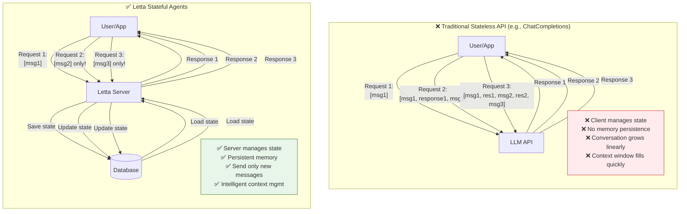
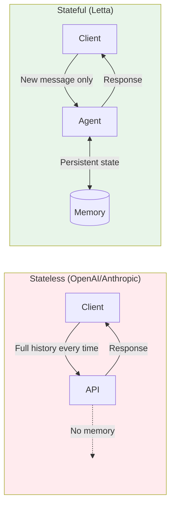

# Stateful vs Stateless: Why Letta is Different

**Location:** Add to `fern/pages/concepts/letta.mdx` early in the document

**What it shows:** The fundamental difference between Letta's stateful agents and traditional stateless LLM APIs.

## Diagram Code



## Alternative: Side-by-Side Comparison



## Comparison Table

```markdown
## Key Differences

| Aspect | Traditional (Stateless) | Letta (Stateful) |
|--------|------------------------|------------------|
| **State management** | Client-side | Server-side |
| **Request format** | Send full conversation history | Send only new messages |
| **Memory** | None (ephemeral) | Persistent database |
| **Context limit** | Hard limit, then fails | Intelligent management |
| **Agent identity** | None | Each agent has unique ID |
| **Long conversations** | Expensive & brittle | Scales infinitely |
| **Personalization** | App must manage | Built-in memory blocks |
| **Multi-session** | Requires external DB | Native support |

## Code Comparison

### Stateless API (e.g., OpenAI)

```python
# You must send the entire conversation every time
messages = [
    {"role": "user", "content": "Hello, I'm Sarah"},
    {"role": "assistant", "content": "Hi Sarah!"},
    {"role": "user", "content": "What's my name?"},  # ← New message
]

# Send everything
response = openai.chat.completions.create(
    model="gpt-4",
    messages=messages  # ← Full history required
)

# You must store and manage messages yourself
messages.append(response.choices[0].message)
```

### Stateful API (Letta)

```python
# Agent already knows context
response = client.agents.messages.create(
    agent_id=agent.id,
    messages=[
        {"role": "user", "content": "What's my name?"}  # ← New message only
    ]
)

# Agent remembers Sarah from its memory blocks
# No need to send previous messages
```

## Explanation Text

> **Why stateful matters:**
>
> **Traditional LLM APIs are stateless** - like hitting "clear chat" after every message. Your application must:
> - Store all messages in a database
> - Send the entire conversation history with each request
> - Manage context window overflow manually
> - Implement memory/personalization logic
> - Handle session management
>
> **Letta agents are stateful services** - like persistent processes. The server:
> - Stores all agent state in its database
> - Accepts only new messages (not full history)
> - Manages context window intelligently
> - Provides built-in memory via editable blocks
> - Maintains agent identity across sessions
>
> **The result:** Instead of building a stateful layer on top of a stateless API, you get statefulness as a primitive.

## Usage Notes

This diagram should appear VERY early in the documentation, ideally:
1. On the main overview page
2. In the concepts/letta.mdx page
3. Referenced in the quickstart

It's the "aha moment" diagram that explains why Letta exists.
