# Letta System Architecture

**Location:** Add to `fern/pages/getting-started/letta_platform.mdx` or `fern/pages/concepts/letta.mdx`

**What it shows:** The complete Letta system with all major components and their relationships.

## Diagram Code


## Deployment Architecture

```mermaid
graph TB
    subgraph Cloud["☁️ Letta Cloud"]
        CLOUD_API[API Gateway]
        CLOUD_SERVERS[Load Balanced<br/>Letta Servers]
        CLOUD_DB[(Managed<br/>PostgreSQL)]
        CLOUD_REDIS[(Redis Cache)]

        CLOUD_API --> CLOUD_SERVERS
        CLOUD_SERVERS --> CLOUD_DB
        CLOUD_SERVERS --> CLOUD_REDIS
    end

    subgraph Self["🏠 Self-Hosted"]
        DOCKER[Docker Container]
        LOCAL_DB[(PostgreSQL<br/>or SQLite)]

        DOCKER --> LOCAL_DB
    end

    subgraph Apps["Your Applications"]
        WEB[Web App]
        MOBILE[Mobile App]
        BOT[Chatbot]
        API_APP[API Service]
    end

    Apps --> Cloud
    Apps --> Self

    style Cloud fill:#e3f2fd
    style Self fill:#fff9c4
```



## Data Flow Diagram


## Component Details

```markdown
## System Components

### Client SDKs
- **Python SDK** (`letta-client`) - Full-featured client for Python applications
- **TypeScript SDK** (`@letta-ai/letta-client`) - Full-featured client for Node.js/TypeScript
- **REST API** - Direct HTTP access for any language
- **ADE (Agent Development Environment)** - Web-based UI for building and testing agents

### Letta Server

#### API Layer
- RESTful endpoints for all operations
- OpenAPI/Swagger specification
- Authentication and authorization
- Request validation

#### Agent Runtime
- **Reasoning Loop** - Manages agent execution steps
- **Tool Executor** - Runs tools in isolated sandbox
- **Memory Manager** - Handles memory block operations and recall

#### Core Services
- **Authentication** - API key management, user sessions
- **Job Queue** - Async task processing
- **Streaming Handler** - Server-sent events for real-time updates

### Storage Layer

#### Database (PostgreSQL or SQLite)
Stores:
- Agent configurations and state
- Memory blocks
- Message history
- Tools and tool definitions
- User accounts and API keys

#### Vector Database (pgvector)
Stores:
- Message embeddings for semantic search
- Document embeddings for data sources
- Enables recall memory and archival search

### External Services

#### LLM Providers
- OpenAI (GPT-4, GPT-3.5)
- Anthropic (Claude)
- Google (Gemini)
- DeepSeek, xAI, Groq, etc.
- Local providers (Ollama, LM Studio, vLLM)

#### Embedding Providers
- OpenAI embeddings
- Local embedding models

#### MCP Servers (Optional)
- External tool providers
- Connect via HTTP/SSE or stdio
- Examples: GitHub, Gmail, databases

## Deployment Options

### Letta Cloud
- Fully managed service
- Multi-tenant architecture
- Automatic scaling
- Built-in monitoring
- 99.9% uptime SLA
- Managed database and infrastructure

**Best for:**
- Quick prototyping
- Production deployments
- No infrastructure management

### Self-Hosted
- Docker container
- Full control over infrastructure
- Your own database
- Custom configuration

**Best for:**
- Data privacy requirements
- Custom infrastructure needs
- Cost optimization at scale
- Air-gapped environments

## Data Flow

1. **Request arrives** - Client sends message to API
2. **Load state** - Agent configuration and memory loaded from DB
3. **Build context** - System prompt, memory blocks, tools assembled
4. **LLM inference** - Context sent to LLM provider
5. **Tool execution** - If LLM calls tools, they execute in sandbox
6. **Iteration** - Loop continues until agent responds to user
7. **Save state** - All changes persisted to database
8. **Response** - Agent response returned to client

## Scaling Characteristics

### Horizontal Scaling
- Multiple Letta server instances behind load balancer
- Shared database for state consistency
- Redis for distributed caching (optional)

### Vertical Scaling
- Increase database resources for more agents
- More CPU/RAM for concurrent agent execution
- SSD for faster database queries

### Performance
- ~1-5 seconds average response time (depends on LLM)
- Thousands of agents per server instance
- Millions of messages stored efficiently
- Concurrent agent execution supported
```

## Architecture Decision Records

```markdown
## Why This Architecture?

### Stateful Server Design
Unlike frameworks that run in your application, Letta is a separate service:
- **Persistent identity** - Agents exist independently
- **Shared access** - Multiple clients can connect to same agents
- **State isolation** - Client logic separated from agent logic
- **Easier debugging** - Centralized state inspection

### Database-Backed
All state in PostgreSQL/SQLite:
- **Durability** - Agents survive server restarts
- **Portability** - Export agents to move between servers
- **Auditability** - Complete history preserved
- **Multi-tenancy** - Secure isolation between users

### Pluggable LLMs
Model-agnostic design:
- **Provider flexibility** - Switch between OpenAI, Anthropic, local, etc.
- **No lock-in** - Your agent data is portable
- **Cost optimization** - Use cheaper models where appropriate
- **Future-proof** - New models work without code changes

### Sandbox Tool Execution
Tools run in isolation:
- **Security** - Untrusted code can't access server
- **Resource limits** - CPU, memory, time constraints
- **Reliability** - One tool crash doesn't kill agent
- **Debugging** - Tool failures are captured and logged
```

## Usage Notes

- Place the **main architecture diagram** on the platform overview page
- Use the **deployment diagram** in the self-hosting guide
- The **data flow diagram** helps debug issues
- The explanation text clarifies why Letta is architected this way
