# Tool Execution Lifecycle

**Location:** Add to `fern/pages/agents/tools.mdx` near the beginning

**What it shows:** How tools are registered, called by agents, executed, and return results.

## Diagram Code


## Alternative: Simplified Flow


## Tool Types Diagram

```mermaid
graph TB
    subgraph Built-in["🔧 Built-in Tools"]
        MEM[Memory Tools<br/>edit_memory, etc.]
        SEND[send_message<br/>Respond to user]
        SEARCH[web_search<br/>Search internet]
        CODE[run_code<br/>Execute code]
    end

    subgraph Custom["⚙️ Custom Tools"]
        PYTHON[Python Functions<br/>Your code]
        MCP[MCP Tools<br/>External servers]
        COMP[Composio Tools<br/>SaaS integrations]
    end

    Agent[Agent] --> Built-in
    Agent --> Custom

    style Built-in fill:#e3f2fd
    style Custom fill:#fff9c4
```



## Explanation to Add

```markdown
## How Tools Work

### 1. Tool Registration

When you create a tool, Letta:
- Parses your function signature and docstring
- Generates an OpenAI-compatible JSON schema
- Stores the tool code and schema in the database

Example:
```python
def search_database(query: str) -> list:
    """
    Search the product database.

    Args:
        query (str): Search query

    Returns:
        list: Matching products
    """
    # Your implementation
    return results
```

Becomes:
```json
{
  "name": "search_database",
  "description": "Search the product database.",
  "parameters": {
    "type": "object",
    "properties": {
      "query": {"type": "string", "description": "Search query"}
    },
    "required": ["query"]
  }
}
```

### 2. Tool Context

When an agent processes a message:
- All attached tool schemas are included in the LLM context
- The LLM decides whether to call a tool or respond directly
- The LLM generates structured tool call arguments

### 3. Execution

When the agent calls a tool:
- **Arguments are validated** against the schema
- **Tool is executed** in an isolated sandbox (for security)
- **Result is returned** and added to the agent's context
- **Agent continues thinking** with the new information

### 4. Security

Tools run in a sandbox with:
- **Resource limits** (CPU, memory, time)
- **Isolated environment** (can't access other agents or server)
- **Restricted imports** (configurable)
- **Execution timeout** (prevents infinite loops)

### 5. Tool Types

#### Memory Tools (Built-in, Always Attached)
- `core_memory_append` - Add to memory block
- `core_memory_replace` - Update memory block
- `archival_memory_insert` - Store long-term facts
- `archival_memory_search` - Retrieve facts
- `conversation_search` - Search message history

#### Communication Tools (Built-in, Default)
- `send_message` - Respond to the user

#### Utility Tools (Built-in, Optional)
- `web_search` - Search the web (Letta Cloud includes credits)
- `run_code` - Execute code in multiple languages

#### Custom Tools
- **Python functions** - Your own code
- **MCP tools** - Connect to MCP servers
- **Composio tools** - Pre-built SaaS integrations

## Tool Call Flow Example

```
User: "What's the weather in SF?"

Agent thinks: "I need weather data"
          ↓
Agent calls: web_search("weather san francisco")
          ↓
Tool executes: Returns "Sunny, 72°F"
          ↓
Agent thinks: "I have the information"
          ↓
Agent calls: send_message("It's sunny and 72°F in San Francisco!")
          ↓
User receives: "It's sunny and 72°F in San Francisco!"
```

## Tool Best Practices

1. **Clear descriptions** - The LLM relies on these to decide when to call tools
2. **Typed arguments** - Use type hints for automatic schema generation
3. **Error handling** - Return informative error messages
4. **Idempotency** - Tools may be called multiple times
5. **Performance** - Keep tool execution fast (< 5 seconds)
```

## Usage Notes

- Place the **sequence diagram** early in the tools documentation
- Use the **simplified flow** in the quickstart
- The **tool types diagram** helps users understand what's available
- The explanation clarifies the "magic" of tool execution
