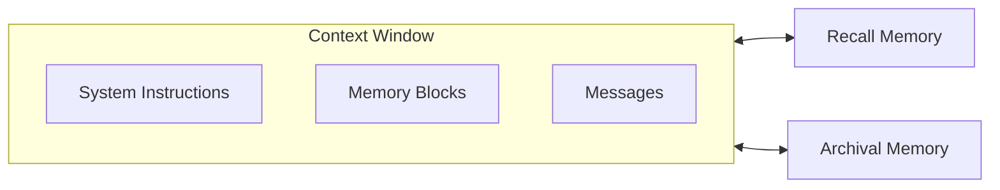

<Note>
**Looking for legacy architecture documentation?** See [Legacy Architectures](/guides/legacy/memgpt_agents_legacy) for information on older agent types with send_message and heartbeats.
</Note>

<Info>
Letta is made by the [creators of MemGPT](https://www.letta.com/about-us). The agent architecture in Letta is built on the MemGPT research paper's concepts of self-editing memory and memory hierarchy.
</Info>

Letta agents solve the context window limitation of LLMs through context engineering across two tiers of memory: **in-context (core) memory** (including system instructions, read-write memory blocks, and conversation history), and **out-of-context memory** (older evicted conversation history and archival storage).

To learn more about the research origins, read the [MemGPT research paper](https://arxiv.org/abs/2310.08560), or take the free [LLM OS course](https://www.deeplearning.ai/short-courses/llms-as-operating-systems-agent-memory/?utm_campaign=memgpt-launch&utm_content=331638345&utm_medium=social&utm_source=docs&hss_channel=tw-992153930095251456) on DeepLearning.ai.

## Memory Hierarchy



### In-context (core) memory

Your agent's context window contains:
- **System instructions:** Your agent's base behavior and capabilities
- **Memory blocks:** Persistent, always-visible information (persona, user info, working state, etc.)
- **Recent messages:** Latest conversation history

### Out-of-context memory

When the context window fills up:
- **Recall memory:** Older messages searchable via `conversation_search` tool
- **Archival memory:** Long-term semantic storage searchable via `archival_memory_search` tool

## Agent Architecture

Letta's agent architecture follows modern LLM patterns:

- **Native reasoning:** Uses model's built-in reasoning capabilities (Responses API for OpenAI, encrypted reasoning for other providers)
- **Direct messaging:** Agents respond with assistant messages
- **Compatibility:** Works with any LLM, tool calling not required
- **Self-directed termination:** Agents decide when to continue or stop

This architecture is optimized for frontier models like GPT-5 and Claude Sonnet 4.5.

[Learn more about the architecture evolution →](https://www.letta.com/blog/letta-v1-agent)

## Memory Tools

Letta agents have tools to manage their own memory:

### Memory block editing
* `memory_insert` - Insert text into a memory block
* `memory_replace` - Replace specific text in a memory block
* `memory_rethink` - Completely rewrite a memory block

### Recall memory
* `conversation_search` - Search prior conversation history

### Archival memory
* `archival_memory_insert` - Store facts and knowledge long-term
* `archival_memory_search` - Query semantic storage

[Learn more about memory tools →](/guides/agents/base-tools)

## Creating Agents

Agents are created with memory blocks that define their persistent context:

<CodeGroup>
```typescript TypeScript
import { LettaClient } from '@letta-ai/letta-client'

const client = new LettaClient({ token: "LETTA_API_KEY" });

const agent = await client.agents.create({
    model: "openai/gpt-4o-mini",
    embedding: "openai/text-embedding-3-small",
    memoryBlocks: [
        {
          label: "human",
          value: "The human's name is Chad. They like vibe coding."
        },
        {
          label: "persona",
          value: "My name is Sam, the all-knowing sentient AI."
        }
    ],
    tools: ["web_search", "run_code"]
});
```

```python Python
from letta_client import Letta

client = Letta(token="LETTA_API_KEY")

agent = client.agents.create(
    model="openai/gpt-4o-mini",
    embedding="openai/text-embedding-3-small",
    memory_blocks=[
        {
          "label": "human",
          "value": "The human's name is Chad. They like vibe coding."
        },
        {
          "label": "persona",
          "value": "My name is Sam, the all-knowing sentient AI."
        }
    ],
    tools=["web_search", "run_code"]
)
```

```bash cURL
curl -X POST https://api.letta.com/v1/agents \
     -H "Authorization: Bearer $LETTA_API_KEY" \
     -H "Content-Type: application/json" \
     -d '{
  "model": "openai/gpt-4o-mini",
  "embedding": "openai/text-embedding-3-small",
  "memory_blocks": [
    {
      "label": "human",
      "value": "The human'\''s name is Chad. They like vibe coding."
    },
    {
      "label": "persona",
      "value": "My name is Sam, the all-knowing sentient AI."
    }
  ],
  "tools": ["web_search", "run_code"]
}'
```
</CodeGroup>

## Context Window Management

When the context window fills up, Letta automatically:
1. Compacts older messages into a recursive summary
2. Moves full message history to recall storage
3. Agent can search recall with `conversation_search` tool

This happens transparently - your agent maintains continuity.

## Populating Archival Memory

Agents can insert memories during conversations, or you can populate archival memory programmatically:

<CodeGroup>
```typescript TypeScript
// Insert a memory via SDK
await client.agents.passages.insert(agent.id, {
    content: "The user prefers TypeScript over JavaScript for type safety.",
    tags: ["preferences", "languages"]
});

// Agent can now search this
// Agent calls: archival_memory_search(query="language preferences")
```
```python Python
# Insert a memory via SDK
client.agents.passages.insert(
    agent_id=agent.id,
    content="The user prefers TypeScript over JavaScript for type safety.",
    tags=["preferences", "languages"]
)

# Agent can now search this
# Agent calls: archival_memory_search(query="language preferences")
```
</CodeGroup>

[Learn more about archival memory →](/guides/agents/archival-memory)

## Research Background

Key concepts from the MemGPT research:

- **Self-editing memory:** Agents actively manage their own memory
- **Memory hierarchy:** In-context vs out-of-context storage
- **Tool-based memory management:** Agents decide what to remember
- **Stateful agents:** Persistent memory across all interactions

[Read the MemGPT paper →](https://arxiv.org/abs/2310.08560)
[Take the free course →](https://www.deeplearning.ai/short-courses/llms-as-operating-systems-agent-memory)

## Next Steps

<CardGroup cols={2}>
  <Card title="Memory Blocks" href="/guides/agents/memory-blocks">
    Deep dive into memory block structure
  </Card>
  <Card title="Archival Memory" href="/guides/agents/archival-memory">
    Long-term semantic storage
  </Card>
  <Card title="Base Tools" href="/guides/agents/base-tools">
    Built-in tools for memory management
  </Card>
  <Card title="Context Engineering" href="/guides/agents/context-engineering">
    Optimizing agent memory usage
  </Card>
</CardGroup>
