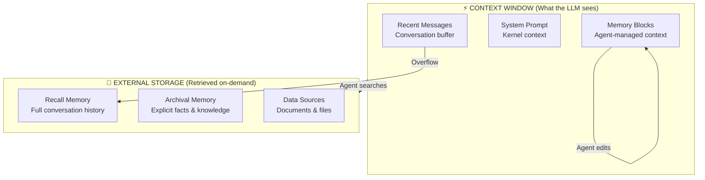

<Tip>
Want to dive deeper? Read our blog posts on [agent memory](https://www.letta.com/blog/agent-memory), [context engineering](https://www.letta.com/blog/guide-to-context-engineering), [memory blocks](https://www.letta.com/blog/memory-blocks), and [RAG vs agent memory](https://www.letta.com/blog/rag-vs-agent-memory).
</Tip>

## What is agent memory?

**Agent memory in Letta is about managing what information is visible in the agent's context window.**

Unlike traditional LLMs that are stateless (forgetting everything between interactions), Letta agents maintain persistent, evolving memory by intelligently managing their context window over time.

The key insight: **the context window is a scarce resource.** You can't fit an entire conversation history or knowledge base into it. Effective memory is about:
- **What's in context right now** (immediately visible to the LLM)
- **What's been moved to external storage** (retrievable when needed)
- **Who decides what stays and what goes** (the agent itself)

## The LLM Operating System

Letta is built on the [MemGPT](https://arxiv.org/abs/2310.08560) paper, which introduced the concept of an "LLM Operating System" for memory management. Just like a computer OS manages different types of memory (registers, RAM, disk), Letta agents manage different tiers of information:



### Memory tiers explained

| Tier | Size | Speed | Managed By | Purpose |
|------|------|-------|------------|---------|
| **System Prompt** | ~1-2K tokens | Instant | System | Agent instructions & behavior |
| **Memory Blocks** | ~2-4K tokens total | Instant | **Agent** | Self-editing structured memory |
| **Message Buffer** | Variable | Instant | System | Recent conversation flow |
| **Recall Memory** | Unlimited | 1-2 sec | Agent via search | Past conversation history |
| **Archival Memory** | Unlimited | 1-2 sec | Agent via search | Explicit facts & knowledge |
| **Data Sources** | Unlimited | 1-2 sec | Agent via search | Uploaded documents |

## Memory blocks: Units of abstraction

**Memory blocks are discrete, structured sections of the context window that agents can read and edit.**

Think of memory blocks as "variables" that persist across interactions:

```python
# Traditional approach: everything is ephemeral
messages = [
    {"role": "user", "content": "I'm Sarah, I like Python"},
    {"role": "assistant", "content": "Hi Sarah!"},
    {"role": "user", "content": "What's my name?"},  # Model only "knows" from message history
]

# Letta approach: structured, persistent memory blocks
memory_blocks = [
    {
        "label": "human",
        "value": "Name: Sarah\nPreferences: Python programming",
        "description": "Key details about the user"
    },
    {
        "label": "persona",
        "value": "I am a helpful coding assistant",
        "description": "My identity and behavior"
    }
]
# Agent can edit these blocks over time as it learns more
```

### Why memory blocks?

**Memory blocks solve the fundamental challenge of context window management:**

1. **Consistency**: Same information is visible across all interactions (not dependent on what fits in message buffer)
2. **Editability**: Agents can update their understanding over time (not just accumulate)
3. **Structure**: Organized sections instead of unstructured message history
4. **Control**: Agents decide what's important enough to persist

### Default memory blocks

Letta agents typically start with two memory blocks:

**Persona Block** - Who the agent is
```
My name is Sam. I am a friendly, professional assistant who helps users
with programming questions. I prefer concise explanations with code examples.
```

**Human Block** - Who the user is
```
The user's name is Sarah. She is a Python developer working on AI applications.
She prefers detailed technical explanations and appreciates best practices.
```

You can add custom blocks for any purpose:
- **Project context**: Current task, goals, progress
- **Organization info**: Company policies, shared knowledge
- **Conversation state**: Multi-step workflow tracking

## Agentic context engineering

**The key innovation in Letta: agents manage their own memory using tools.**

Instead of a fixed context window or simple retrieval, agents actively decide:
- What to remember (write to memory blocks)
- What to forget (remove outdated information)
- What to search for (query external storage)
- How to organize knowledge (restructure memory blocks)

### Memory management tools

Agents have access to these built-in tools:

- `memory_insert` - Add new information to a memory block
- `memory_replace` - Update or rewrite part of a memory block
- `conversation_search` - Search past messages (recall memory)
- `archival_memory_insert` - Store facts in long-term storage
- `archival_memory_search` - Retrieve facts from long-term storage

Example of an agent using memory tools:

```
User: "I'm working on a Next.js app now, not Django anymore"

Agent thinks: "User has shifted tech stacks. I should update my memory."
Agent calls: memory_replace(
    block_label="human",
    old_text="She is a Python developer working on Django apps",
    new_text="She is a full-stack developer currently working on Next.js apps"
)
Agent responds: "Got it! I've updated my notes that you're now working with Next.js."
```

## RAG vs Agent Memory

**Traditional RAG (Retrieval-Augmented Generation):**
- Retrieves semantically similar chunks
- One-shot retrieval per interaction
- Purely reactive (only searches when prompted)
- No persistent understanding

**Letta Agent Memory:**
- Maintains structured, editable memory in context
- Multi-step retrieval (can paginate, refine searches)
- Proactive management (updates memory as it learns)
- Persistent understanding that improves over time

### When to use what

Use **memory blocks** for:
- Information that should be consistently visible
- Knowledge that evolves (user preferences, project state)
- Structured context (persona, relationships, goals)

Use **external memory (RAG-style)** for:
- Large corpora of documents
- Historical conversation logs
- Facts that rarely change
- Information that's too large for context

**Best practice**: Combine both. Memory blocks hold the "executive summary" while external storage holds the full details.

## Sleep-time agents

<Info>
Sleep-time agents are an advanced feature for memory management. See [sleep-time agents guide](/guides/agents/sleep-time-agents) for details.
</Info>

Letta supports **sleep-time compute**: background agents that process and optimize memory while the main agent is idle. This enables:

- **Lower latency**: Main agent doesn't spend time on memory management
- **Better memory**: Dedicated agent can do deeper analysis and reorganization
- **Consistent memory**: Sleep-time agent maintains memory quality over time

Think of it like how humans process memories during sleep - consolidating experiences and strengthening important connections.

## Memory best practices

### 1. Start with clear, specific memory blocks

```python
# ❌ Vague
{"label": "info", "value": "stuff about the user"}

# ✅ Specific
{"label": "user_preferences", "value": "Prefers: Python, VS Code, detailed explanations\nDislikes: Java, Eclipse"}
```

### 2. Write good descriptions

The `description` field tells the agent **when and how** to use the block:

```python
# ❌ Vague description
{
    "label": "project",
    "description": "Project info",
    "value": "Building a chatbot"
}

# ✅ Clear description
{
    "label": "project_context",
    "description": "Current project goals, status, and blockers. Update as progress is made.",
    "value": "Building a customer support chatbot. Status: MVP complete. Next: Add knowledge base integration."
}
```

### 3. Use read-only blocks for shared knowledge

```python
# Shared organizational knowledge that shouldn't change
{
    "label": "company_policies",
    "description": "Company policies and guidelines for reference",
    "value": "Support hours: 9am-5pm PT. Escalation path: ...",
    "read_only": True  # Agent can read but not edit
}
```

### 4. Monitor memory block usage

- Check if blocks are hitting size limits
- Review if agents are actually using the blocks effectively
- Adjust descriptions if agents misuse blocks

## Memory in multi-agent systems

Memory blocks enable powerful multi-agent patterns:

### Shared memory

Multiple agents can share the same memory block:

```python
# Create shared organizational knowledge
org_block = client.blocks.create(
    label="organization",
    value="Mission: Help users build AI agents...",
    description="Shared organizational context"
)

# Both agents see the same block
agent1 = client.agents.create(block_ids=[org_block.id], ...)
agent2 = client.agents.create(block_ids=[org_block.id], ...)
```

### Cross-agent memory updates

Agents can update each other's memory:

```python
# Supervisor agent updates worker agent's context
supervisor_tool = """
def update_worker_context(new_task_description: str):
    client.agents.blocks.modify(
        agent_id=worker_agent_id,
        block_label="current_task",
        value=new_task_description
    )
"""
```

## Next steps

- [Memory Blocks API](/guides/agents/memory-blocks) - Creating and managing memory blocks
- [Context Engineering](/guides/agents/context-engineering) - Advanced memory management patterns
- [Multi-Agent Shared Memory](/guides/agents/multi-agent-memory) - Coordinating memory across agents
- [Sleep-Time Agents](/guides/agents/sleep-time-agents) - Background memory processing

## Further reading

- [Blog: Agent Memory](https://www.letta.com/blog/agent-memory)
- [Blog: Guide to Context Engineering](https://www.letta.com/blog/guide-to-context-engineering)
- [Blog: Memory Blocks](https://www.letta.com/blog/memory-blocks)
- [Blog: RAG vs Agent Memory](https://www.letta.com/blog/rag-vs-agent-memory)
- [MemGPT Research Paper](https://arxiv.org/abs/2310.08560)
