<iframe width="560" height="315" src="https://www.youtube.com/embed/QHhHBLn3MZE?si=c6rfcLFWRpbjR_hT" title="YouTube video player" frameborder="0" allow="accelerometer; autoplay; clipboard-write; encrypted-media; gyroscope; picture-in-picture; web-share" referrerpolicy="strict-origin-when-cross-origin" allowfullscreen></iframe>

Companies generally have customer success agents that handle dozens or even hundreds of accounts. This is a natural pattern to follow when building out AI-based agents too.

But what if each of your customers had their own dedicated customer success agent?

This guide shows you how to get started with customer-specific agents in Letta. Instead of generic chatbots, you'll create persistent agents with dedicated memory for each customer that can research their background and send personalized communications.

As a demo, we'll build a customer success agent template where each new customer gets their own dedicated agent, created from the template, that researches their background, updates its memory, and sends personalized welcome emails.

<Note>
We'll use the [ADE](/agent-development-environment) to build our agents in a UI, but you can use the [Letta API / SDK](/api-reference/overview) to follow all the steps.
</Note>

## Prerequisites

To follow along, you need free accounts for the following platforms:

- **[Letta](https://www.letta.com):** To access the agent development platform
- **[Gmail](https://gmail.com):** To configure the agent's email sending capability
- **[Zapier MCP](https://mcp.zapier.com/mcp):** To set up the MCP email tool integration
- **[Exa](https://exa.ai):** To configure MCP research and LinkedIn lookup tools

## Step 1: Create an agent template

Agent templates serve as blueprints that define your agent's memory structure, tools, and behavior patterns. From the Letta dashboard, click **Templates** → **+ New template** → **Start from scratch**.

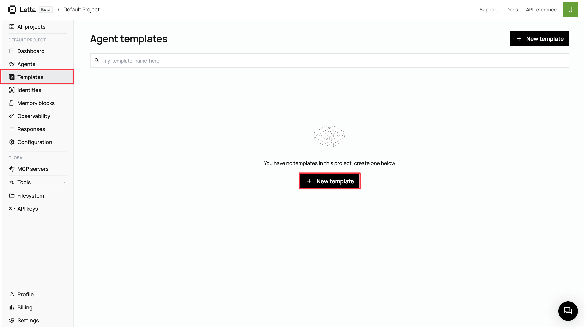

This launches the Agent Development Environment (ADE) with three key areas: a center chat simulator for testing, a left sidebar for configuration (template settings, tools, LLM config), and a right panel showing memory architecture with real-time context utilization.

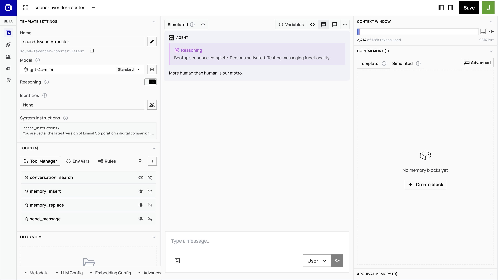

Rename your template `customer-success-agent` by clicking the **pen icon** next to the **Name** field.

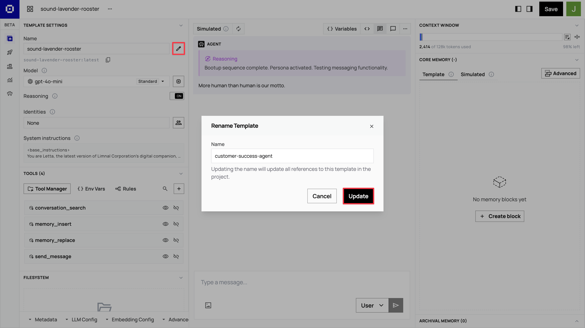

## Step 2: Set up memory blocks

Memory blocks create your agent's persistent knowledge architecture. In the ADE's right panel, in the **Core Memory** section, click **Advanced** → **+ New block** to add custom memory blocks.

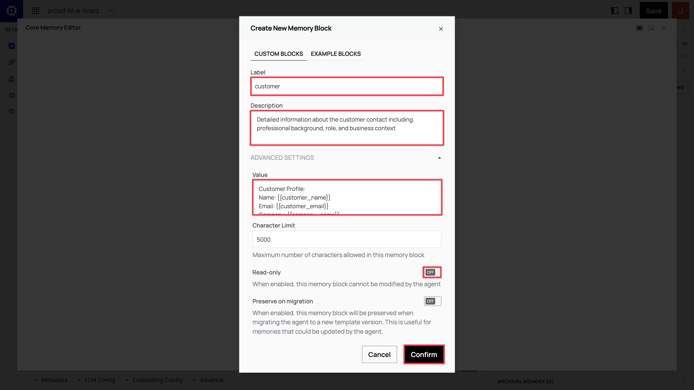

Create four core memory blocks with the following configurations:

<AccordionGroup>
<Accordion title="Customer block: Customer profile and context">
<Steps>
  <Step title="Label">
    `customer`
  </Step>
  <Step title="Description">
    ```
    Detailed information about the customer contact including professional background, role, and business context
    ```
  </Step>
  <Step title="Value">
    ```
    Customer Profile:
    Name: {{customer_name}}
    Email: {{customer_email}}
    Company: {{company_name}}
    Title: {{job_title}}
    Industry: {{industry_sector}}

    Professional Background:
    {{professional_background}}

    Business Challenges:
    {{business_challenges}}

    Communication Preferences:
    {{communication_preferences}}
    ```
  </Step>
</Steps>
</Accordion>

<Accordion title="Organization block: Company knowledge base">
<Steps>
  <Step title="Label">
    `organization`
  </Step>
  <Step title="Description">
    ```
    ACME Manufacturing's company information, products, and value propositions for reference
    ```
  </Step>
  <Step title="Read-only">
    Yes
  </Step>
  <Step title="Value">
    ```
    ACME Manufacturing - Industrial Automation Solutions

    Key Products:
    • QualityCheck AI: Real-time quality control system (reduces defects by 30%)
    • SupplyOptimize: Supply chain optimization platform (20% cost savings)
    • ProductionFlow: Manufacturing workflow automation

    Target Industries: Automotive, Aerospace, Electronics, Medical Devices
    Company Size Focus: 100-1000 employees

    Value Propositions:
    - Reduce manufacturing defects by 25-40%
    - Optimize supply chain costs by 15-25%
    - Improve production efficiency by 20-35%
    - Seamless ERP integration

    Competitive Advantages:
    - Industry-specific AI models trained on manufacturing data
    - 99.7% uptime SLA with 24/7 support
    - ROI typically achieved within 6 months

    Contact Information:
    - Representative: [Your Name]
    - Title: [Your Title]
    ```
  </Step>
</Steps>
</Accordion>

<Accordion title="Tool use guidelines block: Research and communication guidelines">
<Steps>
  <Step title="Label">
    `tool_use_guidelines`
  </Step>
  <Step title="Description">
    ```
    Instructions for effective tool usage and customer research methodology
    ```
  </Step>
  <Step title="Read-only">
    Yes
  </Step>
  <Step title="Value">
    ```
    Research Strategy:
    1. Begin with LinkedIn research to understand the contact's professional background
    2. Use web search to research the customer's company, recent news, and industry challenges
    3. Focus on identifying specific use cases for ACME Manufacturing's solutions
    4. Look for relevant business triggers (growth, challenges, new initiatives)

    Communication Guidelines:
    - Personalize emails based on research findings
    - Reference specific company challenges or industry trends
    - Connect ACME products to customer's likely pain points
    - Maintain professional but approachable tone
    - Include relevant case studies or statistics when appropriate

    Tool Usage Best Practices:
    - Use company_research_exa for comprehensive business intelligence
    - Use linkedin_search_exa for professional background verification
    - Draft emails with research context before sending
    - Update memory blocks with key findings after each research session
    ```
  </Step>
</Steps>
</Accordion>

<Accordion title="Tasks block: Action items and objectives">
<Steps>
  <Step title="Label">
    `tasks`
  </Step>
  <Step title="Description">
    ```
    Current objectives, action items, and next steps for this customer relationship
    ```
  </Step>
  <Step title="Value">
    ```
    Current Priorities:
    1. Complete customer and company research
    2. Identify specific use cases for ACME products
    3. Draft personalized welcome email
    4. Schedule discovery call
    5. Prepare customized demo materials

    Research Checklist:
    - [] LinkedIn professional background research
    - [] Company website and recent news analysis
    - [] Industry-specific challenge identification
    - [] Competitive landscape assessment
    ```
  </Step>
</Steps>
</Accordion>
</AccordionGroup>

The `customer` memory block stores everything your agent learns about the individual customer contact. Template variables are populated when creating agents from this template, while research findings accumulate in descriptive fields.

The `organization` memory block contains static company information that agents reference but shouldn't modify. Set as read-only to ensure consistent messaging across all customer interactions.

The `tool_use_guidelines` memory block contains instructions for how your agent should use its research and communication tools effectively.

The `tasks` memory block contains specific customer onboarding tasks like research, email drafting, and discovery call scheduling with a checklist to track completion.

<Note>
In the `organization` memory block, replace the bracketed placeholders with your actual name and title so the agent sends emails with proper sender identification.
</Note>

### Troubleshooting tool failures

When testing your agent, you may encounter tool call failures. These issues are common across all MCP tools and can usually be resolved quickly with the right approach.

<AccordionGroup>
<Accordion title="Rate limiting errors">
**Problem**: Tools return "too many requests" or "rate limit exceeded" messages

**Solution**: Wait 1-2 minutes before retrying, or break large queries into smaller requests
</Accordion>

<Accordion title="Authentication failures">
**Problem**: Tools fail with "unauthorized" or "invalid credentials" errors

**Solution**: Check your MCP server connections in **Tool Manager** and reconnect your accounts. For Gmail tools, ensure your Gmail account is properly connected in Zapier
</Accordion>

<Accordion title="Network timeouts">
**Problem**: Tools hang or timeout without returning results

**Solution**: Retry the request or simplify your query parameters
</Accordion>

<Accordion title="Invalid queries">
**Problem**: Tools return no results or "invalid format" errors

**Solution**: Rephrase search terms using simpler, more specific language
</Accordion>

<Accordion title="Tool unavailable">
**Problem**: Agent says it cannot access required tools

**Solution**: Verify tools are properly attached to your agent in the Tool Manager
</Accordion>

<Accordion title="API key issues">
**Problem**: Tools fail immediately with connection errors

**Solution**: Verify your API keys are valid and haven't expired. For Exa tools, check your API key at [dashboard.exa.ai/api-keys](https://dashboard.exa.ai/api-keys). For Zapier tools, verify your server URL in the Zapier dashboard
</Accordion>
</AccordionGroup>

### Template variables

The `{{variable_name}}` placeholders in `customer` memory blocks are populated with actual customer data when you create agents from the template and they start interacting with your customers.

## Step 3: Configure MCP tools for customer research

Tools transform your agent from a static responder into an active researcher. In the ADE's left sidebar, click **Tools** → **Tool Manager**. This opens a modal where you'll configure Model Context Protocol (MCP) servers that provide external capabilities.

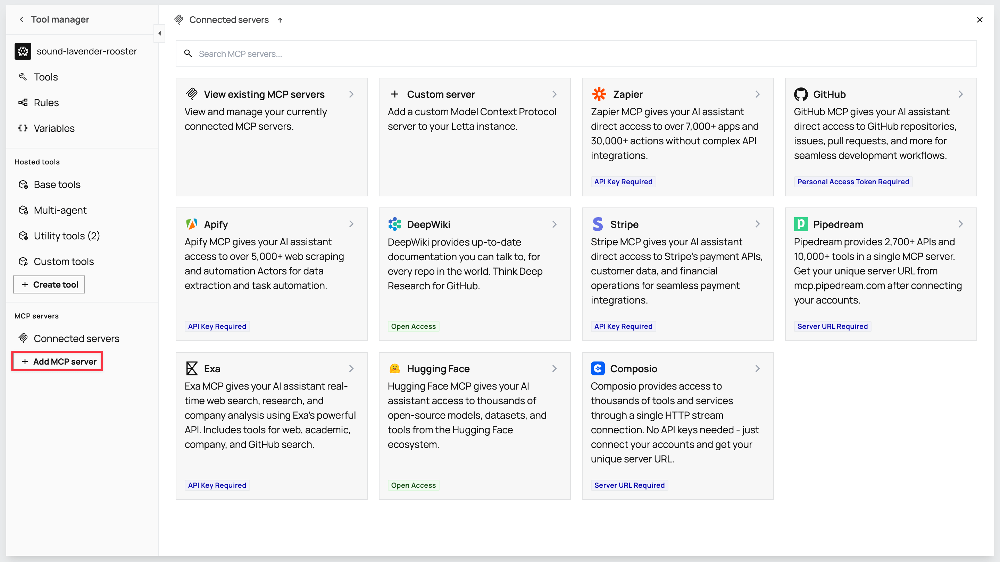

Your agent needs research, communication, email drafting, and email sending tools to gather customer intelligence and send personalized emails.

### Adding Exa for research tools

Exa provides web search, company research, and LinkedIn lookup capabilities for your agent.

<AccordionGroup>
<Accordion title="The complete Exa setup process">
<Steps>
  <Step title="Add the Exa MCP server">
    In the **Tool manager** sidebar, click **+ Add MCP server** in the **MCP servers** section. Select **Exa** from the list to open the configuration modal.
  </Step>
  <Step title="Get an Exa API key">
    Go to [exa.ai](https://exa.ai) to create an account. Then visit [dashboard.exa.ai/api-keys](https://dashboard.exa.ai/api-keys) to copy your default secret key.

    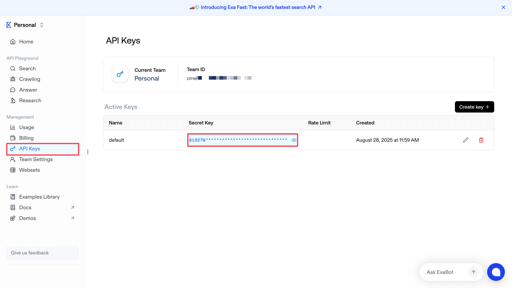
  </Step>
  <Step title="Configure and test the connection">
    Paste the [Exa MCP server URL](https://docs.exa.ai/reference/exa-mcp#remote-exa-mcp) `https://mcp.exa.ai/mcp?exaApiKey=your-exa-api-key` in the Server URL field on the modal. Replace `your-exa-api-key` with your Exa secret key and click **Test connection**. When connected, the modal displays a list of available tools, including `web_search_exa`, `company_research_exa`, and `linkedin_search_exa`. Click **Confirm** to add the server.

    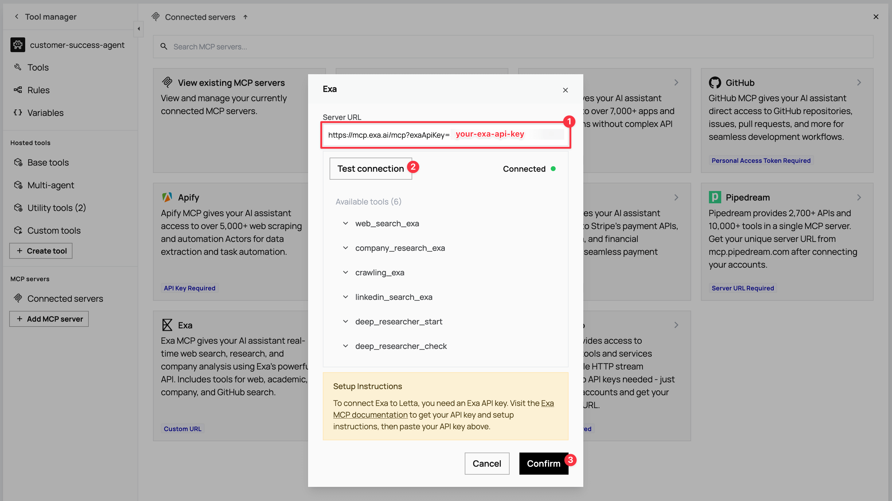
  </Step>
</Steps>
</Accordion>
</AccordionGroup>

### Adding Zapier for email tools

Zapier provides Gmail integration for drafting and sending personalized emails.

<AccordionGroup>
<Accordion title="The complete Zapier setup process">
<Steps>
  <Step title="Add the Zapier MCP server">
    Click **+ Add MCP server** again and select **Zapier**. For the API setup, go to [mcp.zapier.com/mcp](https://mcp.zapier.com/mcp), create an account, then click **+ New MCP Server** in your Zapier dashboard.

    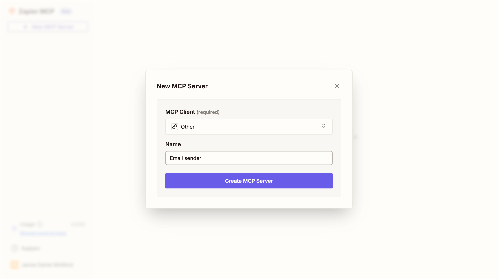
  </Step>
  <Step title="Configure the MCP server">
    Choose **Other** from the **MCP Client** options and name it `Email sender`. After creating the server, click **+ Add tool**, select **Gmail** from the modal, and add the Gmail tools. Connect your Gmail account for sending emails.

    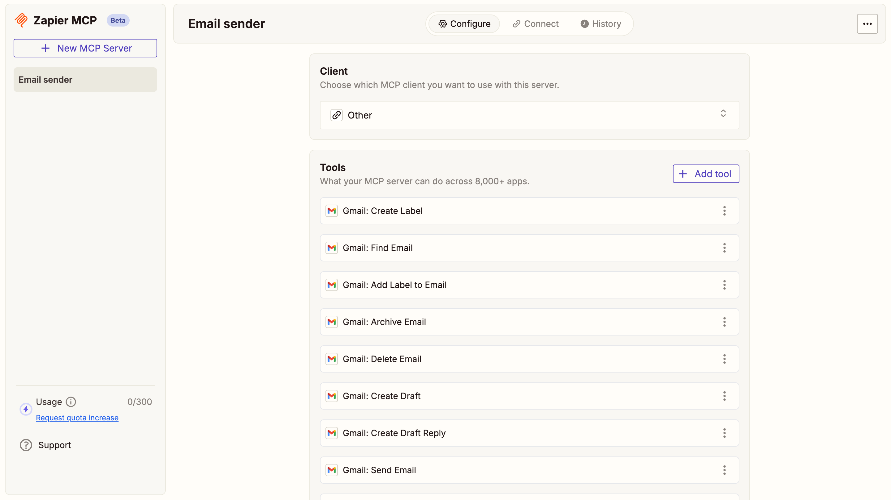
  </Step>
  <Step title="Get the server URL">
    In your Zapier dashboard, click **Connect** in the top toolbar and copy the **Server URL**.

    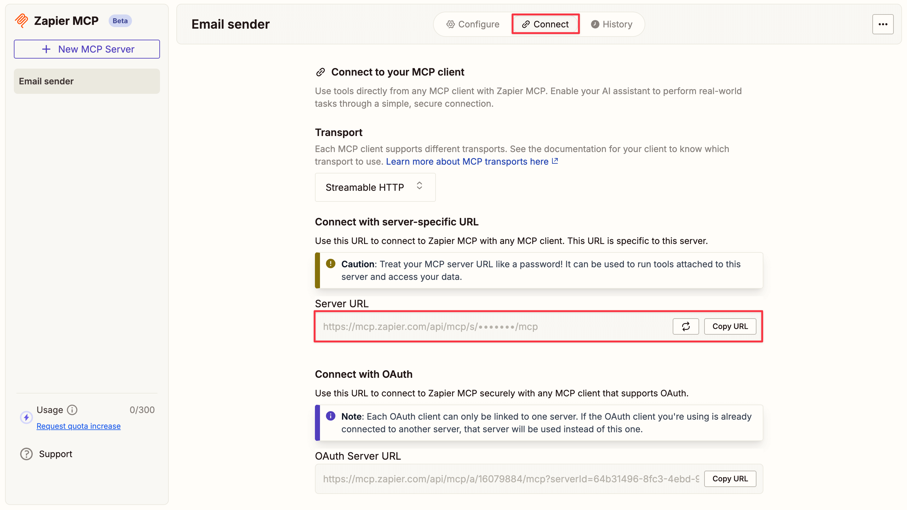
  </Step>
  <Step title="Connect to Letta">
    Return to the Letta modal, paste the server URL in the Server URL field, and test the connection. When you see the Gmail tools appear, click **Confirm**.

    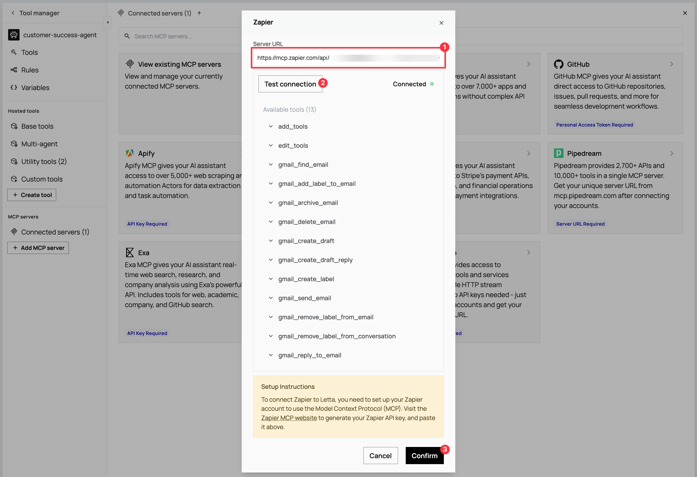
  </Step>
</Steps>
</Accordion>
</AccordionGroup>

### Connecting tools to your agent

In the **Tool manager** view, you can now see both MCP servers. Click each server to view the available tools. To attach them, click the **link icon** next to the tools your agent needs:

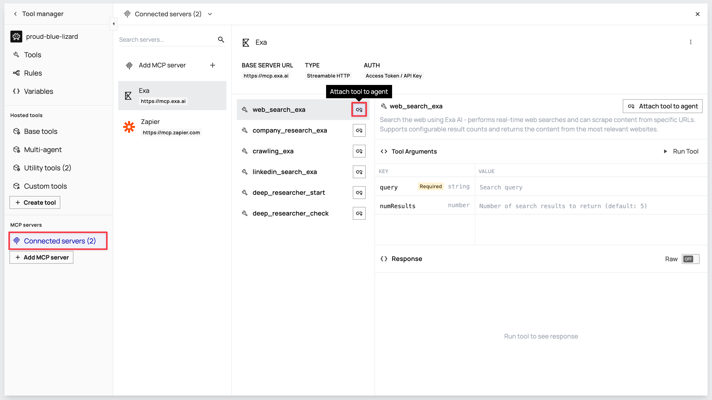

**From Exa**: Attach `web_search_exa`, `company_research_exa`, and `linkedin_search_exa`.

**From Zapier**: Attach `gmail_create_draft` and `gmail_send_email`.

## Step 4: Save your template

Once you've configured all memory blocks and tools, click the **Save** button in the ADE toolbar. This opens a version modal. Click **Save new version** to save your template for agent creation.

Your `customer-success-agent` template is now ready to create customer-specific agents.

## Step 5: Create a customer identity

Before creating agents from your template, you need to set up customer identities. An identity is the customer contact record that represents a unique user and can be associated with one or more agents. An agent is the AI system created for that identity.

This identity-agent relationship enables multi-user applications where each customer gets their own dedicated agent while maintaining proper user isolation and tracking. In a real-world scenario, each new customer that signs up has their identity created (either manually or via API integration). For this demo, you'll create an identity for yourself to test the complete workflow.

Navigate back to the main Letta dashboard and click **Identities** in the left sidebar, then click **+ Create identity**.

In the modal that opens, configure your customer identity using the three fields:

- **Name**: Enter your own full name (for example, `[Your Full Name]`).
- **Identity Type**: Select **User** for individual customer contacts.
- **Unique Identifier**: Create a unique string to identify this customer in your system (for example, `customer_[your_name]`).

Click **Confirm** when all fields are populated.


<Note>
The unique identifier becomes crucial for programmatic agent creation when integrating with CRMs or sign-up workflows. You can use external identifiers like UUIDs from a database or any consistent naming pattern that scales across your customer base.
</Note>

## Step 6: Create an agent from the template

With your template and customer identity ready, navigate to **Agents** in the sidebar and click **+ Create a new agent**.

In the modal, locate the **Create an agent from existing template** section and click on your `customer-success-agent` template.

<Note>
When creating an agent from a template that contains memory variables, Letta prompts you to fill in the variable values before creating the agent. This is where you populate the customer-specific information, like `{{customer_name}}` and `{{customer_email}}`.
</Note>

Fill in your own customer details for testing:


Click **+ Create Agent**. Letta creates the agent and opens the ADE for your new agent instance.

You can see the agent name in the top-left corner of the ADE (for example, **customer-success-agent:1 / random-generated-name**).

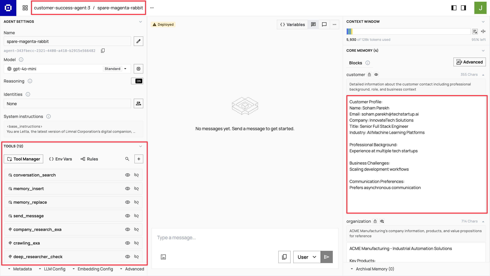

<Note>
Notice that the agent automatically inherits all memory blocks and tools from your template. The memory blocks now contain the populated customer information instead of template variables, and all the research and email tools have already been attached and configured.
</Note>

### Assigning the identity

In the ADE's left sidebar, click the **profile icon** next to the first field in the **Identities** section. Search for your customer identity by name, select it, then click **Update identities** to assign it to the agent.

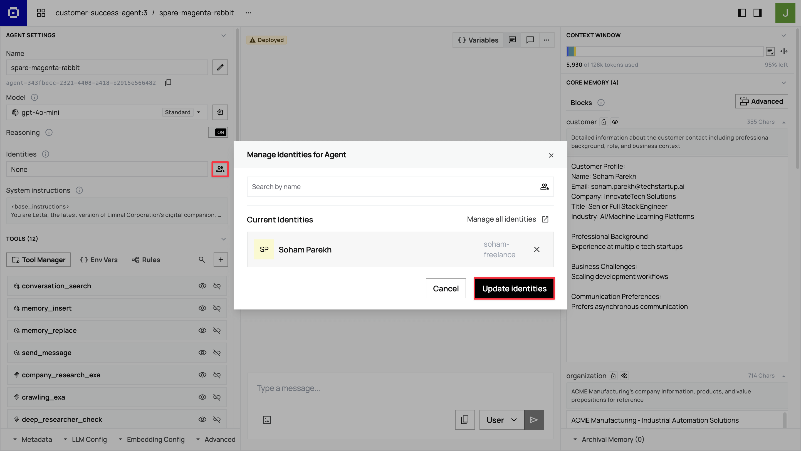

## Step 7: Test the agent

Once you've set up your agent, test the complete workflow with a customer research prompt.

<Note>
Use your own email address for testing, not real customer emails. The agent will actually send emails during testing, so avoid using real customer contact information until you've fully tuned and validated the agent's behavior.
</Note>

In the ADE chat interface, enter the following:

```
Hi! Your new customer [Customer Name] ([email@example.com]) just signed up for our trial. They could benefit from our industrial automation solutions, and they're likely evaluating our platform for potential implementation.

Please research their professional background using LinkedIn and research their company to understand their business and potential needs for ACME Manufacturing's automation solutions. Update your memory blocks with your findings, then draft and send a personalized welcome email that references their background and suggests relevant ACME solutions.

Complete the full workflow: research, memory updates, email draft, and email sending. Provide a summary of your research findings and confirm when the email has been sent.
```

<Note>
Replace `[Customer Name]` and `[email@example.com]` with actual customer details for testing. Use your own email address so you can receive and review the personalized welcome email the agent sends.
</Note>

The agent will execute the workflow by using its research tools, updating memory blocks with findings, and sending a personalized welcome email. You can observe the process in real time and review the generated email output to ensure quality and personalization. Check your email inbox to see the final personalized message the agent created and sent.

<Success>
Congratulations! You've built a customer-specific agent system that can research customer backgrounds and send personalized welcome emails.
</Success>

## What's next?

You've built a customer-specific agent system that handles initial onboarding and welcome emails. Here are two key ways to expand this foundation:

<AccordionGroup>
<Accordion title="Forward customer emails to agents using Zapier integration">
Set up automatic email forwarding so your agents can handle ongoing customer communications beyond the initial welcome. When customers reply to emails or send new messages, Zapier can route them to their dedicated agents, allowing the agents to update their memory with new information, draft contextual responses based on conversation history, and maintain personalized interactions across multiple touchpoints. This transforms your agents from one-time onboarding tools into continuous relationship managers.

<Note>
The [Letta-Zapier integration](https://zapier.com/developer/public-invite/227319/7256d6a770965fa8f67ca718244356ff/) is currently in development and available for early testing. The integration is being reviewed by Zapier for public release.
</Note>
</Accordion>

<Accordion title="Scaling with the SDK">
To create agents programmatically from your `customer-success-agent` template, use the Letta SDK:

<CodeGroup>
```typescript TypeScript
import { LettaClient } from '@letta-ai/letta-client';

const client = new LettaClient({ token: "your-api-token" });

// Create agent from template for new customer
const agent = await client.templates.agents.create({
    project: "your-project",
    templateVersion: "customer-success-agent:latest",
    memoryVariables: {
        customerName: "John Smith",
        customerEmail: "john@techparts.com",
        companyName: "TechParts Industries",
        jobTitle: "Manufacturing Director",
        industrySector: "Industrial Equipment",
        professionalBackground: "15+ years in manufacturing operations",
        businessChallenges: "Looking to reduce defects and optimize supply chain",
        communicationPreferences: "Prefers data-driven discussions"
    },
    identityIds: ["customer_john_smith"]
});
```

```python Python
from letta_client import Letta

client = Letta(token="your-api-token")

# Create agent from template for new customer
agent = client.templates.agents.create(
    project="your-project",
    template_version="customer-success-agent:latest",
    memory_variables={
        "customer_name": "John Smith",
        "customer_email": "john@techparts.com",
        "company_name": "TechParts Industries",
        "job_title": "Manufacturing Director",
        "industry_sector": "Industrial Equipment",
        "professional_background": "15+ years in manufacturing operations",
        "business_challenges": "Looking to reduce defects and optimize supply chain",
        "communication_preferences": "Prefers data-driven discussions"
    },
    identity_ids=["customer_john_smith"]
)
```
</CodeGroup>

This approach integrates with CRM systems, sign-up workflows, and customer onboarding automation. See the [Letta SDK documentation](https://docs.letta.com/api-reference/templates/agents/create) for complete API reference.
</Accordion>
</AccordionGroup>

**Other possibilities to explore:**
- Agents that schedule meetings and manage follow-ups
- Integration with support ticket systems for context-aware assistance
- Advanced analytics that track relationship progression and agent effectiveness

The combination of persistent memory, research tools, and personalized communication provides a foundation for building more sophisticated customer relationship systems over time.
